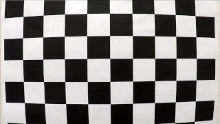
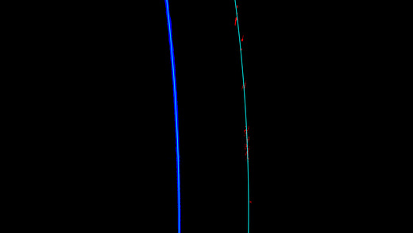

Advanced Lane Finding
============================================

In this project, I wrote a software pipeline comprised of various Computer Vision techniques to identify the lane boundaries in a video as a prototype for autonomous car perception system responsible for lane navigation.

## Project Structure

Project has following directory structure:  

**.**  
**├── data**                 - folder with all data  
**│   ├── camera_cal**       - camera calibration images    
**│   ├── test_images**      - folder with raw test images  
**│   ├── videos**           - folder with raw videos  
**│   ├── output_images**    - here goes all processed test images  
**│   └── output_videos**    - here goes all processed videos  
**├── lanefinder**           - project's source code  
**│   ├── calibration.py**   - module with camera calibration related code  
**│   ├── detect.py**        - module with detection related code  
**│   ├── exceptions.py**    - module with custom exceptions  
**│   ├── paths.py**         - module with path constants  
**│   ├── pipeline.py**      - module with pipline related code  
**│   ├── processing.py**    - entry-point module that launches image/video processing  
**│   ├── thresholding.py**  - module with image thresholding related code  
**│   ├── transform.py**     - module with image transformation related code  
**│   └── utils.py**         - module with common-purpose functionality code
**├── report**               - folder with report images  
**├── calibration.p**        - pickle file with saved calibration matrices  
**└── requirements.txt**     - project library requirements  

## Pipeline  

Following diagram shows key components of the software pipeline and flow of the data through them. Below the diagram is the detailed description of the pipline nodes.  

  

### Camera Calibration  

Because no camera lens or sensor are perfect both of those components add distortions to the image they capture. Before proceeding to the lane detection these distortions have to be addressed first.  
In this project I'm using set of images capturing chessboard from various angles.  
  
By detecting corners of the chessboard it is possible to calculate calibration matrices.  
  
Calculated calibration matrices are stored into pickle file *calibration.p* to be reused later during video processing. This way calibration process can be skipped to reduce processing time.  
After calibration process images and video frames can be undistorted using calibration matrices.  
  

### Thresholding  

To build the model of the lane it is first necessary to segment-out pixels that belong to the lane lines. In this project I'm using gradient and color thresholding to create binary masks of the line pixels.  

#### Gradient thresholding  

Image gradients show how fast pixel intensity is changing in vertical and horizontal directions. Thus it is possible to detect edges and lines on the images.  
So to separate road lines I created binary mask that shows pixels which gradient magnitude and direction are within specified boundaries.  
  
 
 This method produces well defined lines that are easy to use for creating line models. But one of the big downsides of such approach is if intensity of the line is low compared to the road it's very difficult to discern it using gradients.  
 
 

#### Color thresholding  

To address shortcomings of the gradient thresholding I combined it with color thresholding. Color thresholding is the process of image segmentation based on the color of particular pixel.  
But due to changing conditions on the road (e.g. shadows) choosing colors in RGB color space is unreliable. Instead I used HSL color space that separates Hue and Saturation of the color from Lightness that changes the most in the shadows. Using thresholds based on Hue boaundaries and Saturation I achieved much more consistent lane lines separation.  

 

### Cut ROI

When looking for the lane we can make a rough guess where on the image it can be, we'll call it out region of interest (ROI). By eliminating all pixels outside of this region we can reduce processing time and reduce noise that can affect model calculation.  

### Bird-view perspective  

Bird-eye view persective (aka top view perspective) can be advantageous in many calculations. I'm using it here as well as it will significantly simplify mathematical models used to find lane lines.  

  

### Lane detection 

This pipeline node is responsible for choosing pixels that will belong to the lane lines, creating polynomial model of theses lines and creation of the Lane object that encopsulates both and add extra functionality such as line curvature calculation and car offset from the lane center.  

Lane pixels can be chosen either from scratch or using prior lane models.  
When looking for lane from scratch I first used histograms of the bottom part of the image to find initial bottom lane lines positions. It is done by finding two histogram peaks on left and right halfs of the image each. 

I used small windows around these initial positions to determine which pixels are close enough to it. If window covers enough masked pixels algorithm calculates new position for the windows drawn on top of the first ones. These process of sliding windows repeats until it reaches top of the image (in bird-eye view perspective).  

Second approach takes advantage of the fact that lanes don't move much in adjacent frames. As such we can use prior lane line models to create area where new lines' pixels should be. All masked pixels that are covered by this area becomes part of the new Lane object.  

Finally after finding left and right lines pixel locations we can fit polynomial of second degree (x = Ay^2 + By + C) to it, which will become our line models. 

------------------------DELETE-------------------------------------  
The goals / steps of this project are the following:

* Compute the camera calibration matrix and distortion coefficients given a set of chessboard images.
* Apply a distortion correction to raw images.
* Use color transforms, gradients, etc., to create a thresholded binary image.
* Apply a perspective transform to rectify binary image ("birds-eye view").
* Detect lane pixels and fit to find the lane boundary.
* Determine the curvature of the lane and vehicle position with respect to center.
* Warp the detected lane boundaries back onto the original image.
* Output visual display of the lane boundaries and numerical estimation of lane curvature and vehicle position.

The images for camera calibration are stored in the folder called `camera_cal`.  The images in `test_images` are for testing your pipeline on single frames.  If you want to extract more test images from the videos, you can simply use an image writing method like `cv2.imwrite()`, i.e., you can read the video in frame by frame as usual, and for frames you want to save for later you can write to an image file.  

To help the reviewer examine your work, please save examples of the output from each stage of your pipeline in the folder called `output_images`, and include a description in your writeup for the project of what each image shows.    The video called `project_video.mp4` is the video your pipeline should work well on.  

The `challenge_video.mp4` video is an extra (and optional) challenge for you if you want to test your pipeline under somewhat trickier conditions.  The `harder_challenge.mp4` video is another optional challenge and is brutal!

If you're feeling ambitious (again, totally optional though), don't stop there!  We encourage you to go out and take video of your own, calibrate your camera and show us how you would implement this project from scratch!
