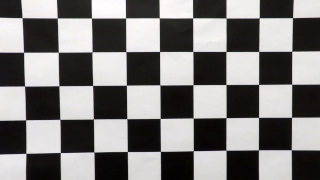

Advanced Lane Finding
============================================

In this project, I wrote a software pipeline comprised of various Computer Vision techniques to identify the lane boundaries in a video as a prototype for autonomous car perception system responsible for lane navigation.

## Project Structure

Project has following directory structure:  

**.**  
**├── data**                 - folder with all data  
**│   ├── camera_cal**       - camera calibration images    
**│   ├── test_images**      - folder with raw test images  
**│   ├── videos**           - folder with raw videos  
**│   ├── output_images**    - here goes all processed test images  
**│   └── output_videos**    - here goes all processed videos  
**├── lanefinder**           - project's source code  
**│   ├── calibration.py**   - module with camera calibration related code  
**│   ├── detect.py**        - module with detection related code  
**│   ├── exceptions.py**    - module with custom exceptions  
**│   ├── paths.py**         - module with path constants  
**│   ├── pipeline.py**      - module with pipline related code  
**│   ├── processing.py**    - entry-point module that launches image/video processing  
**│   ├── thresholding.py**  - module with image thresholding related code  
**│   ├── transform.py**     - module with image transformation related code  
**│   └── utils.py**         - module with common-purpose functionality code
**├── report**               - folder with report images  
**├── calibration.p**        - pickle file with saved calibration matrices  
**└── requirements.txt**     - project library requirements  

## Pipeline  

Following diagram shows key components of the software pipeline and flow of the data through them. Below the diagram is the detailed description of the pipline nodes.  

  

### Camera Calibration  

Because no camera lens or sensor are perfect both of those components add distortions to the image they capture. Before proceeding to the lane detection these distortions have to be addressed first.  
In this project I'm using set of images capturing chessboard from various angles.  
  
By detecting corners of the chessboard it is possible to calculate calibration matrices.  
  
Calculated calibration matrices are stored into pickle file *calibration.p* to be reused later during video processing. This way calibration process can be skipped to reduce processing time.  
After calibration process images and video frames can be undistorted using calibration matrices.  
  

### Thresholding  

------------------------DELETE-------------------------------------  
The goals / steps of this project are the following:

* Compute the camera calibration matrix and distortion coefficients given a set of chessboard images.
* Apply a distortion correction to raw images.
* Use color transforms, gradients, etc., to create a thresholded binary image.
* Apply a perspective transform to rectify binary image ("birds-eye view").
* Detect lane pixels and fit to find the lane boundary.
* Determine the curvature of the lane and vehicle position with respect to center.
* Warp the detected lane boundaries back onto the original image.
* Output visual display of the lane boundaries and numerical estimation of lane curvature and vehicle position.

The images for camera calibration are stored in the folder called `camera_cal`.  The images in `test_images` are for testing your pipeline on single frames.  If you want to extract more test images from the videos, you can simply use an image writing method like `cv2.imwrite()`, i.e., you can read the video in frame by frame as usual, and for frames you want to save for later you can write to an image file.  

To help the reviewer examine your work, please save examples of the output from each stage of your pipeline in the folder called `output_images`, and include a description in your writeup for the project of what each image shows.    The video called `project_video.mp4` is the video your pipeline should work well on.  

The `challenge_video.mp4` video is an extra (and optional) challenge for you if you want to test your pipeline under somewhat trickier conditions.  The `harder_challenge.mp4` video is another optional challenge and is brutal!

If you're feeling ambitious (again, totally optional though), don't stop there!  We encourage you to go out and take video of your own, calibrate your camera and show us how you would implement this project from scratch!
